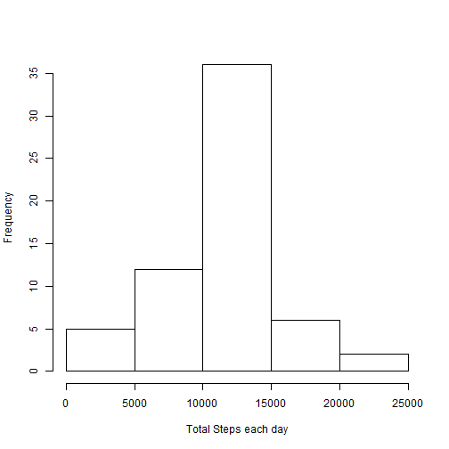

1.Reading the Activity Data

```r
data<-read.csv("activity.csv")
```

2.Total number of steps taken per day  
Total number of steps taken each day (Plot)

```r
ad<-aggregate(steps~date ,data=data, FUN=sum)
hist(ad$steps, xlab="Total Steps each day", , main="")
```

 

Mean and Median total number of steps taken per day

```r
meana<-mean(ad$steps)
median<-median(ad$steps)
data.frame(mean=meana, median)
```

```
##    mean median
## 1 10766  10765
```

  
  
  
3.Average daily activity pattern  
Average daily steps taken at 5-minute intervals (plot)

```r
adt<-aggregate(steps~interval ,data=data, FUN=mean)
plot(adt$interval, adt$steps, type="l", xlab="time interval", ylab="average steps")
```

 

Maximum steps taken at which 5-minute time interval

```r
max<-adt$interval[which(adt$steps==max(adt$steps))]
max
```

```
## [1] 835
```
  
  
  
  
4.Imputing missing values  
  
Total NA rows

```r
length(data[is.na(data$steps),"steps"])
```

```
## [1] 2304
```

Strategy for filling NAs: 
Replace steps on the NA Interval by mean of steps on that interval  

```r
dta<-data

return_impute_value <- function(inter){
    
return(mean(dta[dta$interval==inter, "steps"], na.rm=T))
}

dta[is.na(dta$steps),"steps"]<-unlist(lapply(dta[is.na(dta$steps),"interval"], return_impute_value), recursive =T)
```
  
Histogram of total steps per day after imputing NAs and  
effect on Mean and Median


```r
ad1<-aggregate(steps~date ,data=dta, FUN=sum)
hist(ad1$steps, xlab="Total Steps each day", , main="")
```

 

  

```r
meana<-mean(ad1$steps)
median<-median(ad1$steps)
data.frame(mean=meana, median)
```

```
##    mean median
## 1 10766  10766
```
Only a slight visible change occurs in median because we had already NAs removed when using the aggregate function.  
This shows that our imputation is good!  
  
  
  
  Total Steps before and after Imputed values. 

```r
data.frame(Total_Steps_With_NAs=sum(ad$steps), Total_Steps_with_Imputed_Values=sum(ad1$steps))
```

```
##   Total_Steps_With_NAs Total_Steps_with_Imputed_Values
## 1               570608                          656738
```

5. Patterns between weekdays and weekends  
Creating a new factor variable showing weekdays or weekends and add to data frame

```r
new_data<-data
days<-weekdays(as.Date(dta$date))
days[days!="Saturday" & days!="Sunday"]="weekday"
days[days=="Saturday" | days=="Sunday"]="weekend"
factor(days)
new_data$day<-days
```
  
  Ploting the trend on different days(Weekdays, Weekends): Average daily steps taken at 5-minute intervals

```r
new_adt <- aggregate(steps ~ interval + day, data = new_data, mean)
ggplot(new_adt, aes(interval, steps)) + facet_grid(day ~ .) + geom_line() +  xlab("5-minute interval") + ylab("Number of steps")
```

 
  
  It can be observed that on weekdays the Steps are more at early time intervals (morning). And in the middle of the day time intervals activity is more at weekends.
